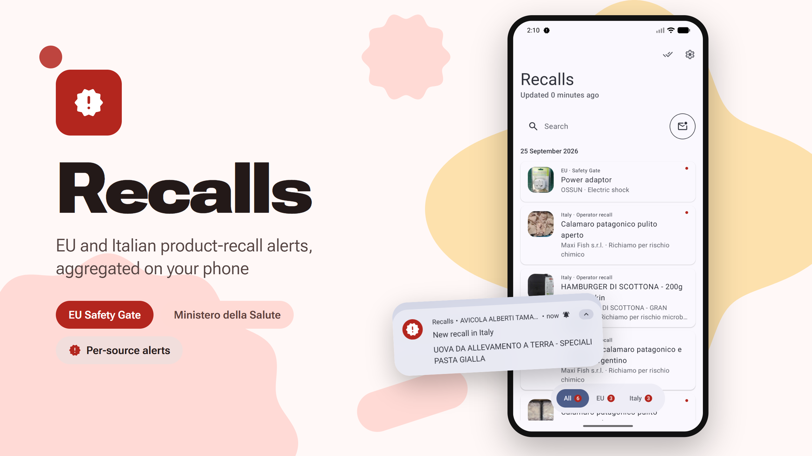
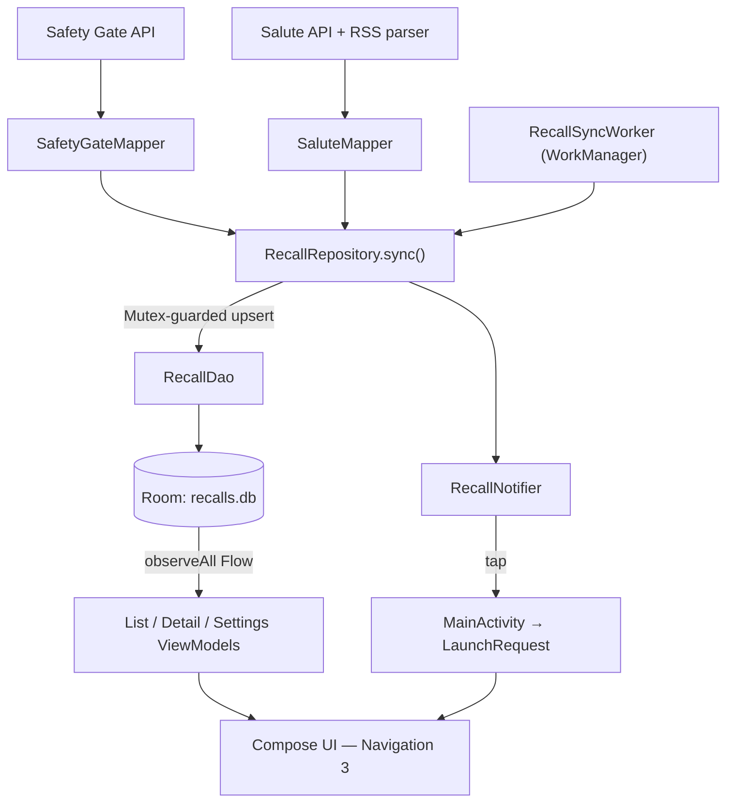

<!-- prettier-ignore -->
<div align="center">

<picture>
  <source media="(prefers-color-scheme: dark)" srcset="docs/cover-dark.png" />
  <source media="(prefers-color-scheme: light)" srcset="docs/cover-light.png" />
  
</picture>

[](https://github.com/fuji97/Recalls/actions/workflows/android.yml)
[](https://github.com/fuji97/Recalls/releases/latest)

[](https://kotlinlang.org)
[](https://m3.material.io)
[](LICENSE)

<a href="obtainium://add/https://github.com/fuji97/Recalls"></a>
<a href="https://github.com/fuji97/Recalls/releases/latest"></a>

[Overview](#overview) • [Features](#features) • [Architecture](#architecture) • [Getting started](#getting-started) • [Project structure](#project-structure) • [Testing](#testing)

</div>

**Recalls** is a native Android app that pulls together product-recall alerts from two official sources — the EU **Safety Gate** system (non-food products) and the Italian **Ministero della Salute** (operator food recalls plus Ministry food-safety warnings) — into a single, searchable, notifying list. There's no backend of its own: the app talks directly to `ec.europa.eu` and `www.salute.gov.it`, stores results locally with Room, and checks for updates periodically with WorkManager.

> [!NOTE]
> This is an independent, unofficial client. It is not affiliated with, endorsed by, or connected to the European Commission or the Italian Ministero della Salute. Always verify recall information against the official sources linked from each detail screen.
>
> Both sources are public-sector data under **CC BY 4.0**, reused with attribution. See [`docs/LEGAL.md`](docs/LEGAL.md) for licences, attribution requirements and known caveats.

> [!WARNING]
> This app is **vibe-coded**: most of it was written by an LLM with light human review, not a hand-audited codebase. Expect rough edges, unreviewed logic paths, and bugs that a fully human-reviewed app would have caught. Don't treat recall data shown here as more reliable than the official sources it's fetched from.

## Overview

Recalls exists because the two source sites are hard to monitor: Safety Gate has no push notifications, and the Ministero della Salute portal is a large, slow-loading dataset with no per-item alerting. The app instead:

- Syncs all three feeds (Safety Gate, IT operator recalls, IT Ministry warnings) into one Room database on a user-configurable schedule.
- Loads a rolling **90-day history window** on every sync, without pruning rows already stored locally.
- Posts a notification per newly-seen item, grouped by source, with a silent first-ever sync so installing the app doesn't spam you with years of backlog.
- Lets you filter by source (EU / Italy / unread), search, and drill into a detail screen with images, risk descriptions, and a link to the original notice — including the recall PDF for Italian operator recalls.

## Features

- **Unified feed** — Safety Gate, Italian operator recalls, and Italian Ministry warnings in one chronological list.
- **Background sync** — WorkManager job on a user-selectable interval (1 / 3 / 6 / 12 / 24 h, default 6h), plus manual "check now".
- **Per-source notifications** — one channel for EU, one for Italy (operator + Ministry share it), independently toggleable.
- **Source filters & search** — quick chips for All / EU / Italy / Unread, plus free-text search across titles and brands.
- **Rich detail screen** — product images (with PDF-embedded photo extraction for Italian recall notices), risk types, batch numbers, barcodes, measures taken, and a share action.
- **Read-state preserved across sync** — re-syncing never resets which items you've already read.
- **Bilingual UI** — English and Italian, following the device locale; Safety Gate content is requested in the matching language.
- **Material 3 Expressive** — built on `material3 1.5.0-alpha29` with `MotionScheme.expressive()`.

## Architecture

No backend, no Hilt — a single `AppContainer` built once in `RecallsApp.onCreate()` wires up manual dependency injection for the whole app.



Key invariants worth knowing before touching sync logic:

- **`RecallRepository.sync()`** is the only place that orchestrates all three sources. Each source runs in its own `try/catch`; one failing never aborts the others, and the worker only retries when *all three* errors are network-flavored.
- **Partial upserts** (`RecallDao.upsertContent`) never touch the `isNew` / `isRead` columns, so a re-sync can't clobber what you've already read.
- **Baseline sync is silent** — `SourceStateEntity.baselineDone` gates whether newly-seen rows are marked new / notified, so the first sync per source never triggers a notification storm.

See [`AGENTS.md`](AGENTS.md) for the full package-by-package breakdown and implementation conventions, and [`docs/DATA_SOURCES.md`](docs/DATA_SOURCES.md) for the verified request/response shapes of both remote APIs.

## Tech stack

| Layer | Choice |
| --- | --- |
| UI | Jetpack Compose, Material 3 Expressive (`compose-bom-alpha`), Navigation 3 |
| Persistence | Room (`recalls.db`), DataStore Preferences (settings) |
| Background work | WorkManager (periodic + one-shot sync) |
| Networking | OkHttp with a Chrome user-agent interceptor, `kotlinx.serialization.json` |
| Images | Coil 3, backed by the same OkHttp client; custom PDF-photo decoder for Italian recall notices |
| DI | Manual (`AppContainer`), no Hilt/Koin |
| Async | Kotlin coroutines + `Flow`, `Mutex`-serialized sync |

## Getting started

### Prerequisites

- JDK on `PATH` — developed and verified against a JDK 21 daemon (`gradle/gradle-daemon-jvm.properties` pins toolchain 25).
- Android SDK with platform `android-37.2` and `build-tools;37.0.0` (matches CI).

> [!IMPORTANT]
> Always use the Gradle wrapper (`gradlew.bat` on Windows, `./gradlew` on Linux/macOS) — never a global `gradle` install.

### Clone and build

```bat
git clone https://github.com/fuji97/Recalls.git
cd Recalls
gradlew.bat :app:testDebugUnitTest :app:assembleDebug
```

The debug APK lands at `app/build/outputs/apk/debug/app-debug.apk`.

```bat
gradlew.bat clean :app:assembleDebug   REM clean rebuild, use after dependency/version changes
```

### Manual smoke test

Install the debug APK, launch, grant the notification permission, and verify EU + Italy cards load with thumbnails. Exercise the source filter chips and open a detail screen. See `docs/MANUAL_TESTING.md` for the full scripted checklist, including sqlite3-based new-item/notification testing.

## Project structure

All under `app/src/main/java/it/federicorapetti/recalls/`:

```
data/
  remote/safetygate/   Safety Gate DTOs, API client, DTO → domain mapper
  remote/salute/       Salute DTOs, hand-rolled RSS parser, API client, mapper
  remote/Http.kt       Shared OkHttpClient, Chrome UA interceptor, execute() helper, AppJson
  local/                Room entities, RecallDao, RecallDatabase
  settings/             DataStore-backed SettingsRepository
  RecallRepository.kt   Sync orchestration — the only place that talks to all three sources
sync/                   SyncScheduler (WorkManager), RecallSyncWorker, RecallNotifier
ui/
  list/, detail/, settings/   Screen + ViewModel per feature
  navigation/                  Navigation 3 keys, LaunchRequest, RecallsNavHost
  theme/                       MaterialExpressiveTheme setup
AppContainer.kt / RecallsApp.kt   Manual DI wiring and app entry point
MainActivity.kt                  Notification-tap → LaunchRequest translation
```

## Testing

Unit tests are pure-JVM (JUnit 4) and cover the deterministic transformation layer — DTO → domain mappers and the RSS parser — using fixtures under `app/src/test/resources/` that encode edge cases (null-title fallback, withdrawn/revoked items, an unrelated top-level JSON array the streaming decoder must skip, an empty RSS `<link/>`).

```bat
gradlew.bat :app:testDebugUnitTest
```

ViewModels, Compose UI, WorkManager scheduling, Room queries, and notification posting are currently verified manually (emulator install + scripted checks) per `docs/MANUAL_TESTING.md` — no Robolectric or instrumented tests are wired up yet.

## Releases

Tagging `vX.Y.Z` on `main` triggers a signed release build (`.github/workflows/android.yml`), with release notes generated by [git-cliff](https://git-cliff.org) from Conventional Commits (`cliff.toml`) — only `feat`, `fix`, `perf`, and breaking (`type!:`) commits are listed. Preview notes locally before tagging:

```bash
npx --yes git-cliff@2.14.2 --unreleased --tag vX.Y.Z --strip all
```

## License

MIT — see [LICENSE](LICENSE). The MIT licence covers the app's code only.

### Data sources

Recall data is not part of this repository. Each device fetches it at runtime from:

- **EU Safety Gate**: © European Union, [CC BY 4.0](https://creativecommons.org/licenses/by/4.0/) ([Commission legal notice](https://commission.europa.eu/legal-notice_en)).
- **Ministero della Salute**: salute.gov.it, [CC BY 4.0](https://creativecommons.org/licenses/by/4.0/) (site *Note legali*). Operator recall PDFs and the photos inside them belong to their publishers and are shown only to identify recalled products.

Recalls reformats this data. It is not affiliated with or endorsed by either operator. See [`docs/LEGAL.md`](docs/LEGAL.md) for the full review and the compliance checklist.
